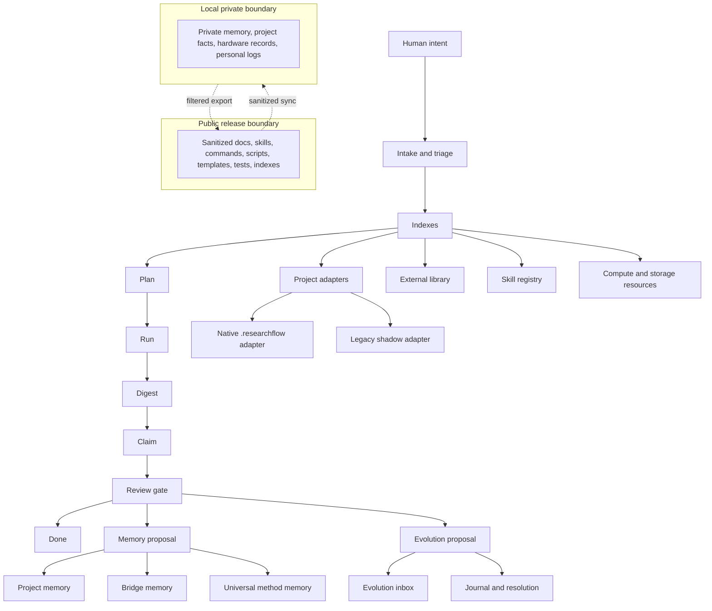
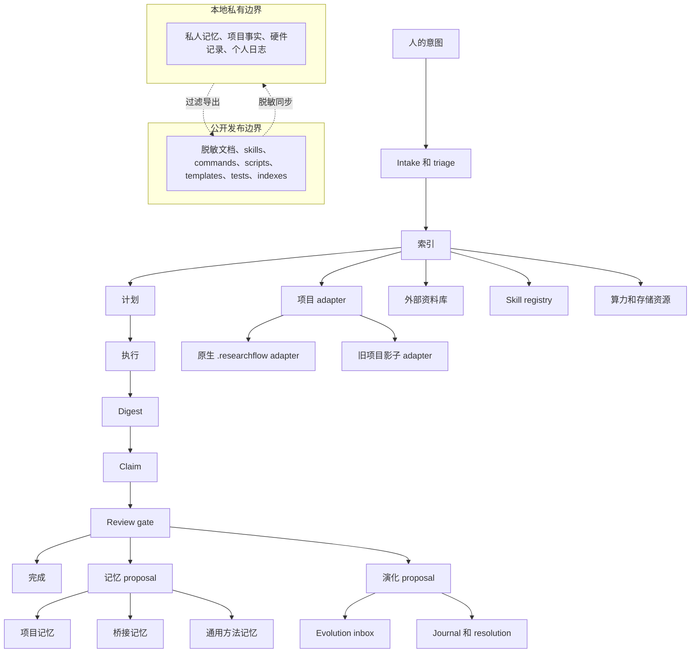

# ResearchFlow

[](#中文说明)
[](#validation)
[](#philosophy)

ResearchFlow is an index-first workflow framework for agent-assisted research, experimentation, and project execution. It is designed for environments where long conversations, heterogeneous files, simulation artifacts, cross-project knowledge, and personal research habits can easily exceed an agent's working context.

The framework treats context as a scarce research resource. Agents first read compact indexes, then open evidence only when the task requires it. This keeps token cost low, reduces memory drift, and makes the reasoning path auditable.

## Philosophy

ResearchFlow is built around a simple thesis: the human should spend attention on creative research judgment, while agents should absorb mechanical, repeated, and verifiable work after the first successful human-agent run has clarified intent.

An agent should not be reduced to a brittle sequence of point commands. It should operate from purpose, evidence, boundaries, and reusable procedures. Natural language remains the primary interface because a well-scoped intention gives the agent room to choose the right tool, while ResearchFlow's indexes, validators, and review gates keep that flexibility from becoming uncontrolled behavior.

## Project Characteristics

Functional characteristics:

- Natural-language onboarding for new and existing projects.
- Native project adapters for projects that can accept `.researchflow/` metadata.
- Legacy shadow adapters for projects that must not be modified.
- Universal, bridge, project, and external-library knowledge layers.
- Evolution inbox, issue records, journals, resolutions, and self-check paths for framework upgrades.
- Skill inventory and skill usage records, including which agent skills were useful in which project context.
- Resource and storage indexes for compute-aware research planning.
- Public/private release boundaries for publishing sanitized framework material.

Technical characteristics:

- JSONL indexes provide high-density entry points before body files are loaded.
- Read policies such as `index_only`, `on_demand`, `adapter_first`, `registry_only`, and `skip` control context loading.
- A compact state machine keeps agent runs resumable: `intake -> triage -> plan -> run -> digest -> claim -> review -> done`.
- Markdown frontmatter templates standardize claims, digests, memory proposals, procedures, evolution records, and skill usage logs.
- Lightweight Python validators check index structure, memory proposal safety, project adapter boundaries, release hygiene, and prompt loading rules.
- Public releases are generated from a sanitized export, not directly from the private local working tree.

## Topology



## Documentation

- [User Manual](docs/user-manual.md): natural-language workflows, project onboarding, memory capture, skill reuse, and routine use.
- [Technical Manual](docs/technical-manual.md): architecture, data model, adapter contracts, validators, indexes, and topology.
- [Local-Public Sync Manual](docs/local-public-sync.md): standard process for keeping the local framework and sanitized public repository aligned.

## Quick Start

You can say this directly in a Codex thread:

```text
Connect the current project to ResearchFlow. This project may create .researchflow; complete the onboarding, validation, and logging.
```

Or:

```text
Connect /abs/path/to/old-project to ResearchFlow in compatibility mode. Do not modify that project directory; use the zero-intrusion legacy path, then validate and record the result.
```

Or in a ResearchFlow project thread:

```text
Please connect /abs/path/to/project to my ResearchFlow workflow. If the project directory can be written, use native mode; if unsure, ask me first.
```

## Repository Layout

```text
commands/          operational entry points
docs/              user, technical, and sync manuals
framework/         policy, state, context, memory, and boundary rules
skills/            Codex-compatible routing skills
prompts/           on-demand prompt contracts
scripts/           lightweight validators and project adapter tools
templates/         reusable records and adapter templates
indexes/           sanitized public indexes
tests/             regression tests for framework invariants
```

## Privacy And Release Boundaries

This public repository intentionally excludes private memory, personal knowledge bases, real project history, hardware records, and local usage logs. Public material should describe the framework, not leak a specific user's research history.

The standard boundary is:

- publish sanitized framework rules, manuals, scripts, skills, commands, templates, tests, and safe indexes;
- keep private project facts, personal preferences, hardware inventory, raw logs, and local memory in the private local ResearchFlow tree;
- use local private memory only to drive release configuration, then remove sensitive values from public files before commit.

## Validation

Run the test suite:

```bash
python3 -m unittest discover -s tests -v
```

Run the framework validator:

```bash
python3 scripts/rf_validate.py . --strict
```

Validate a connected project adapter:

```bash
python3 scripts/rf_project_validate.py \
  --framework-root . \
  --adapter /path/to/project.rf.yaml \
  --strict
```

## Current Scope

This release is a public framework skeleton, documentation set, and validation reference. It is suitable for studying, adapting, and extending the workflow, but it does not include private memories, real project history, personal knowledge-base material, or machine-specific configuration.

---

# 中文说明

[](#researchflow)
[](#validation)
[](#philosophy)

ResearchFlow 是一个面向 agent 辅助科研、实验和项目执行的 index-first 工作流框架。它适用于长对话、复杂文件、大量模拟结果、跨项目知识和个人科研习惯容易超过 agent 工作上下文的场景。

框架把上下文视为稀缺科研资源。Agent 应先读高密度索引，再按任务需要打开证据正文，从而降低 token 消耗、减少记忆漂移，并让推理路径可复查。

## 理念

ResearchFlow 的核心判断是：人应该把注意力留给创造性的科研判断，agent 应该在第一次人机协作跑通意图之后，承担机械、重复、可验证的工作。

Agent 不应该只是僵硬执行一串点对点指令。它应围绕目的、证据、边界和可复用流程工作。自然语言是主要入口，因为清晰的意图能给 agent 留出选择合适工具的空间；而 ResearchFlow 的索引、校验器和 review gate 会约束这种灵活性，避免它变成不可控行为。

## 项目特点

功能特点：

- 使用自然语言接入新项目和旧项目。
- 原生项目 adapter 适用于可以写入 `.researchflow/` 元数据的项目。
- 旧项目影子 adapter 适用于不能修改目录结构的项目。
- 通用记忆、桥接记忆、项目记忆和外部资料库分层。
- Evolution inbox、事项、日志、决议和自检路径用于框架自升级。
- Skill 清单和使用日志记录哪些 agent skill 在什么项目场景中有效。
- 算力和存储索引用于科研任务分配规划。
- 公开/本地边界用于发布脱敏后的框架材料。

技术特点：

- JSONL 索引在读取正文前提供高密度入口。
- `index_only`、`on_demand`、`adapter_first`、`registry_only`、`skip` 等读取策略控制上下文加载。
- 小型状态机让 agent 运行可恢复：`intake -> triage -> plan -> run -> digest -> claim -> review -> done`。
- Markdown frontmatter 模板统一 claim、digest、memory proposal、procedure、evolution record 和 skill usage log。
- 轻量 Python 校验器检查索引结构、记忆 proposal 安全性、项目 adapter 边界、发布卫生和 prompt 默认读取规则。
- 公开发布来自脱敏导出目录，而不是直接从本地私有工作树发布。

## 拓扑关系



## 文档

- [使用手册](docs/user-manual.md)：自然语言工作流、项目接入、记忆捕获、skill 复用和日常使用。
- [技术手册](docs/technical-manual.md)：架构、数据模型、adapter contract、校验器、索引和拓扑。
- [本地-公开同步手册](docs/local-public-sync.md)：保持本地框架和脱敏公开仓库一致的标准流程。

## 快速开始

你以后可以直接在 Codex 线程里这样说：

```text
把当前项目接入 ResearchFlow。这个项目可以创建 .researchflow，你来完成接入、验证和记录。
```

或：

```text
把 /abs/path/to/old-project 兼容接入 ResearchFlow。不要修改那个项目目录，用旧项目零侵入方式完成接入、验证和记录。
```

或在 ResearchFlow 项目线程里说：

```text
请把 /abs/path/to/project 接入我的 ResearchFlow 工作流。能写入项目目录就用原生方式，不能确定就先问我。
```

## 仓库结构

```text
commands/          操作入口
docs/              使用手册、技术手册和同步手册
framework/         策略、状态、上下文、记忆和边界规则
skills/            Codex 兼容的路由 skill
prompts/           按需读取的 prompt contract
scripts/           轻量校验器和项目 adapter 工具
templates/         标准记录模板
indexes/           脱敏后的公开索引
tests/             框架不变量回归测试
```

## 隐私与发布边界

此公开仓库刻意排除了私人记忆、个人知识库、真实项目历史、硬件记录和本地使用日志。公开材料只描述框架，不泄露某个具体用户的研究历史。

标准边界是：

- 可以发布脱敏后的框架规则、手册、脚本、skills、commands、templates、tests 和安全索引；
- 私人项目事实、个人偏好、硬件清单、原始日志和本地记忆保留在本地私有 ResearchFlow 树；
- 本地私有记忆只用于驱动发布配置，提交公开仓库前必须移除敏感值。

## 校验

运行测试：

```bash
python3 -m unittest discover -s tests -v
```

运行框架校验：

```bash
python3 scripts/rf_validate.py . --strict
```

校验某个项目 adapter：

```bash
python3 scripts/rf_project_validate.py \
  --framework-root . \
  --adapter /path/to/project.rf.yaml \
  --strict
```

## 当前范围

这个版本是公开的框架骨架、文档集和校验参考，适合学习、改造和扩展工作流；它不包含私人记忆、真实项目历史、个人知识库内容或本机配置。
