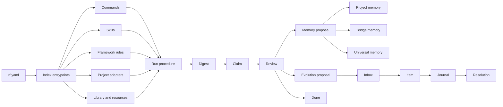
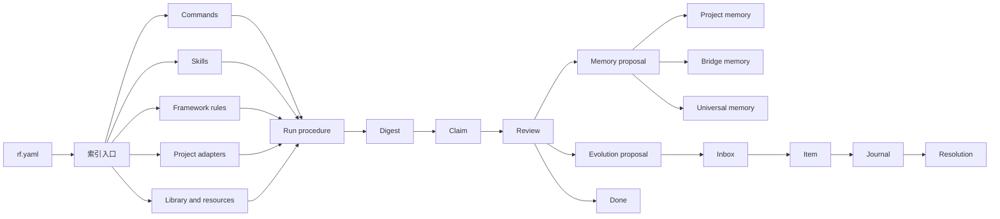

# ResearchFlow Technical Manual

**Scope:** public-sanitized technical reference for the framework architecture.

## 1. System Boundary

ResearchFlow is a workflow framework, not a monolithic application. Its main job is to define how an agent should load context, classify information, run work, record evidence, and decide whether a result can become memory or a reusable procedure.

The public repository contains framework structure and validation references. The local private tree may contain personal memory, project-specific adapters, private evolution history, and machine-specific resource records.

## 2. Core Layers

```text
rf.yaml
  framework policy and index entrypoints

indexes/
  compact JSONL registries used before body files are opened

framework/
  stable rules, state machine, memory policy, context loading, and boundaries

commands/
  reusable operational procedures

skills/
  agent-facing routing instructions

prompts/
  on-demand prompt contracts

templates/
  structured records for claims, digests, memory proposals, procedures, and evolution

scripts/
  validators and adapter creation helpers

docs/
  human-readable user, technical, and sync manuals
```

## 3. State Machine

The main state machine is intentionally small:

```text
intake -> triage -> plan -> run -> digest -> claim -> review -> done
```

Branch states include:

- `needs_user`: creative judgment, permissions, external commitments, or ambiguous intent.
- `blocked`: real blocker after attempted progress.
- `memory_proposed`: a proposed memory update awaits review.
- `memory_applied`: approved memory has been applied.
- `upgrade_proposed`: a framework upgrade is proposed.
- `upgrade_applied`: an approved upgrade has been applied.
- `aborted`: the run was intentionally stopped.

This compact model prevents every project from inventing a separate agent lifecycle.

## 4. Index Model

Indexes are JSONL files. Each line is a compact record that points to a body file, external source, adapter, or registry entry.

Common fields:

```json
{
  "schema_version": 1,
  "id": "documentation:user-manual",
  "kind": "documentation",
  "title": "User Manual",
  "status": "active",
  "path": "docs/user-manual.md",
  "created_at": "2026-05-30",
  "updated_at": "2026-05-30",
  "checksum": "",
  "read_policy": "on_demand"
}
```

Read policies:

- `index_only`: safe to load as a compact entrypoint.
- `on_demand`: load the body only when relevant.
- `adapter_first`: use project adapter metadata before scanning a project.
- `registry_only`: use as a lookup table.
- `skip`: do not load by default.

## 5. Memory Model

ResearchFlow distinguishes memory layers:

- **Project memory:** concrete implementation facts for one project.
- **Bridge memory:** transferable lessons derived from one or more project observations, with explicit scope.
- **Universal memory:** stable methods, recurring failure modes, and durable personal operating preferences.
- **External library:** study and research material indexed for lookup, not default agent memory.

The rule is evidence before memory. A result should usually become a digest or claim before it is proposed as durable memory.

## 6. Project Adapter Model

Project adapters connect ResearchFlow to external projects.

Native adapter:

```text
<project-root>/.researchflow/project.rf.yaml
```

Legacy shadow adapter:

```text
project-interfaces/legacy/<safe-project-id>/project.rf.yaml
```

Native mode is preferred when the project can safely store metadata. Legacy mode is preferred when the target project must remain unchanged.

Global project indexes remain pointer-only. Project-specific facts should live in the adapter or project-local files, not in the global framework index.

## 7. Agent Execution Contract

An agent using ResearchFlow should:

1. Load `rf.yaml` and relevant indexes first.
2. Avoid heavy files unless the index shows relevance.
3. Convert user input into a normalized intent when writing logs.
4. Keep raw user signal when recording evolution.
5. Run deterministic scripts when structure must be validated.
6. Write digests before claims for non-trivial results.
7. Require review before memory application or framework upgrades.
8. Report residual risk and what was not done.

## 8. Validation Surface

Public validators:

- `scripts/rf_validate.py`: framework tree validation.
- `scripts/rf_project_validate.py`: project adapter validation.
- `scripts/rf_project_connect.py`: adapter creation helper used by agents.

Important invariants:

- index records must include required fields;
- release marker words are rejected in framework-facing public files;
- prompt contracts must not enter `default_read`;
- unsafe memory proposals fail validation;
- project adapters must respect native and legacy boundaries;
- global project indexes must remain pointer-only.

## 9. Technical Topology



## 10. Public Release Architecture

Public releases should be generated from a separate sanitized export. The export should include:

- framework rules;
- public manuals;
- commands;
- public skills;
- prompt contracts;
- scripts;
- templates;
- sanitized indexes;
- tests.

The export should exclude:

- private memory;
- real project adapters;
- personal knowledge-base content;
- hardware records;
- local usage history;
- private evolution logs;
- absolute local paths;
- credentials or access details.

---

# ResearchFlow 技术手册

**范围：** 公开脱敏技术参考，描述框架架构。

## 1. 系统边界

ResearchFlow 是工作流框架，不是单体应用。它的主要职责是规定 agent 如何加载上下文、分类信息、执行工作、记录证据，以及判断结果是否可以进入记忆或可复用流程。

公开仓库包含框架结构和校验参考。本地私有树可以包含个人记忆、项目 adapter、私有 evolution 历史和具体机器资源记录。

## 2. 核心层级

```text
rf.yaml
  框架策略和索引入口

indexes/
  在读取正文前使用的紧凑 JSONL registry

framework/
  稳定规则、状态机、记忆策略、上下文加载和边界

commands/
  可复用操作流程

skills/
  面向 agent 的路由说明

prompts/
  按需读取的 prompt contract

templates/
  claim、digest、memory proposal、procedure 和 evolution 的结构化模板

scripts/
  校验器和 adapter 创建工具

docs/
  给人阅读的使用手册、技术手册和同步手册
```

## 3. 状态机

主状态机保持很小：

```text
intake -> triage -> plan -> run -> digest -> claim -> review -> done
```

分支状态包括：

- `needs_user`：需要创造性判断、权限、外部承诺或澄清意图。
- `blocked`：已经尝试推进但存在真实阻塞。
- `memory_proposed`：记忆更新等待审查。
- `memory_applied`：批准后的记忆已写入。
- `upgrade_proposed`：框架升级已提出。
- `upgrade_applied`：批准后的升级已应用。
- `aborted`：运行被有意停止。

这个小模型避免每个项目重新发明一套 agent 生命周期。

## 4. 索引模型

索引是 JSONL 文件。每一行都是一个紧凑记录，指向正文文件、外部来源、adapter 或 registry 条目。

通用字段：

```json
{
  "schema_version": 1,
  "id": "documentation:user-manual",
  "kind": "documentation",
  "title": "User Manual",
  "status": "active",
  "path": "docs/user-manual.md",
  "created_at": "2026-05-30",
  "updated_at": "2026-05-30",
  "checksum": "",
  "read_policy": "on_demand"
}
```

读取策略：

- `index_only`：可以作为紧凑入口读取。
- `on_demand`：只有相关时读取正文。
- `adapter_first`：扫描项目前先读取项目 adapter。
- `registry_only`：作为查找表使用。
- `skip`：默认不读取。

## 5. 记忆模型

ResearchFlow 区分不同记忆层：

- **项目记忆：** 某个项目的具体实现事实。
- **桥接记忆：** 从一个或多个项目观察中抽象出的可迁移经验，并带有适用范围。
- **通用记忆：** 稳定方法、反复出现的失败模式和持久个人操作偏好。
- **外部资料库：** 供检索的学习和研究资料，不作为默认 agent 记忆。

规则是证据先于记忆。非平凡结果通常应先成为 digest 或 claim，再提出长期记忆 proposal。

## 6. 项目 Adapter 模型

项目 adapter 负责连接 ResearchFlow 和外部项目。

原生 adapter：

```text
<project-root>/.researchflow/project.rf.yaml
```

旧项目影子 adapter：

```text
project-interfaces/legacy/<safe-project-id>/project.rf.yaml
```

当项目可以安全保存元数据时优先使用原生模式；当目标项目不能被修改时使用旧项目模式。

全局项目索引只保存指针。项目特定事实应保存在 adapter 或项目本地文件中，而不是写入全局框架索引。

## 7. Agent 执行约定

使用 ResearchFlow 的 agent 应该：

1. 先加载 `rf.yaml` 和相关索引。
2. 避免读取索引没有指向的大文件。
3. 写日志时把用户输入归一化为清晰意图。
4. 记录 evolution 时保留原始用户信号。
5. 结构需要验证时运行确定性脚本。
6. 非平凡结果先写 digest，再提出 claim。
7. 写入记忆或升级框架前经过 review。
8. 汇报剩余风险和未完成事项。

## 8. 校验面

公开校验器：

- `scripts/rf_validate.py`：框架树校验。
- `scripts/rf_project_validate.py`：项目 adapter 校验。
- `scripts/rf_project_connect.py`：agent 使用的 adapter 创建辅助工具。

关键不变量：

- 索引记录必须包含必需字段；
- 面向框架的公开文件不能包含发布阻断标记；
- prompt contract 不得进入 `default_read`；
- 不安全的 memory proposal 会校验失败；
- 项目 adapter 必须遵守原生和旧项目边界；
- 全局项目索引必须保持 pointer-only。

## 9. 技术拓扑



## 10. 公开发布架构

公开发布应来自单独的脱敏导出目录。导出目录可以包含：

- 框架规则；
- 公开手册；
- commands；
- 公开 skills；
- prompt contracts；
- scripts；
- templates；
- 脱敏索引；
- tests。

导出目录应排除：

- 私人记忆；
- 真实项目 adapter；
- 个人知识库正文；
- 硬件记录；
- 本地使用历史；
- 私有 evolution logs；
- 绝对本地路径；
- 凭证或访问细节。
